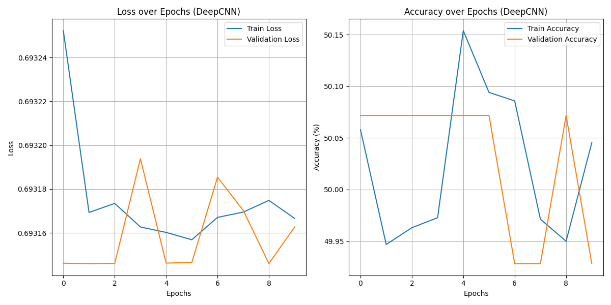

# Проект по классификации обложек книг

В проекте модель для обучения сверточной нейронной сети

Результат



## Запуск

Поднять пространство:

```cmd
python3 -m venv venv
```

```cmd
source venv/bin/activate
```

Запуск обучения

```cmd
make
```

Если с torch ошибка

```cmd
pip3 install --pre torch torchvision torchaudio --index-url https://download.pytorch.org/whl/nightly/cpu
```
